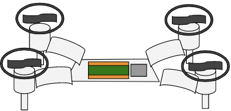

## Drone
### By Paul Schakel and Sam Funk

### Project Vision
Drone to lift a raspberry pi pico off the ground because the fact that it is on the ground is a problem. A drone seems like the all around simplest solution to this problem.
Success = working drone
Risk mitigation: cages around propellers, only flight test with teacher supervision, safety glasses

&nbsp;

### Drawing

Central platform will hold Pico, circuit board, and battery. Four arms will extend out to hold the motors + propellers, which will have a guard/cage around them and a leg/foot underneath. 

&nbsp;

### Code 
Need to connect to controller
Initiate motors
Collect accelerometer data
While true:
Check for input from controller - > move based on input
Constant balancing - make force of propellers equal to force of gravity

Need several functions - rotate, move up and down, tilt
Move up - force of propellers greater than force of gravity - higher motor speed
Move down - force of propellers less than force of gravity - lower motor speed
Tilt - allows to move laterally - two motors at higher speed than others
Rotation - two types of propellers used to cancel out torque - 1 and 3 are one type, 2 and 4 are another. These two types rotate in different directions to cancel out torque. To rotate the drone, one of the types of propellers have to spin at a higher speed than the other

&nbsp;

### What We Need to Learn
Wireless connection (bluetooth?)
Wireless remote/controller
PID

&nbsp;

### Bill of Materials
* Acrylic (~4 sq. feet)
* 3D print material maybe
* Propellers (4)
* LiPo battery (1)
* Raspberry pi pico (1)
* Altimeter (1)
* Accelerometer (1)
* Hardware - nuts and bolts, maybe standoffs for Pico

&nbsp;

### Schedule
11/28 - finish planning, research motors, aerodynamics, etc

12/5 - discuss + order propellers, start working on CAD and code
	Initial wiring for code testing
	
12/12 - CAD - finish main drone body
	Code - Start prototyping first flight functions - vertical, horizontal, spinning movement

Winter Break
1/3 - “Initial CAD + Code” 
CAD - design brackets + cages for motors and brackets for arms
Code - Start getting motors to work
1/9 - CAD - finalize design, maybe cut/print
	Code - PID
1/17 - CAD - Cut/print, assemble drone
	Code - PID
1/24 - learn how to make a circuit board and design it
	Continue working on PID
1/30 - “Functional prototype creation”
print circuit board and wire everything
Finish PID
2/6 - See if it works
2/13 - testing, tweaking coding
2/21 - testing and tweaking
2/27 - “Design refinement and final tweaks”
3/6 - add bluetooth
3/13 - add bluetooth
3/20 - add bluetooth
3/27 - test/tweak bluetooth controller
Spring Break
4/10 - “Launches + data collection”
	Fly drone around
4/17 - fly it some more
4/24 - show off / brag
5/1 - “Analyze data + finalize documentation”

