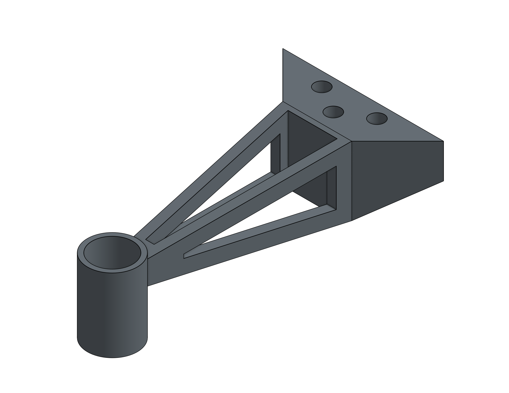
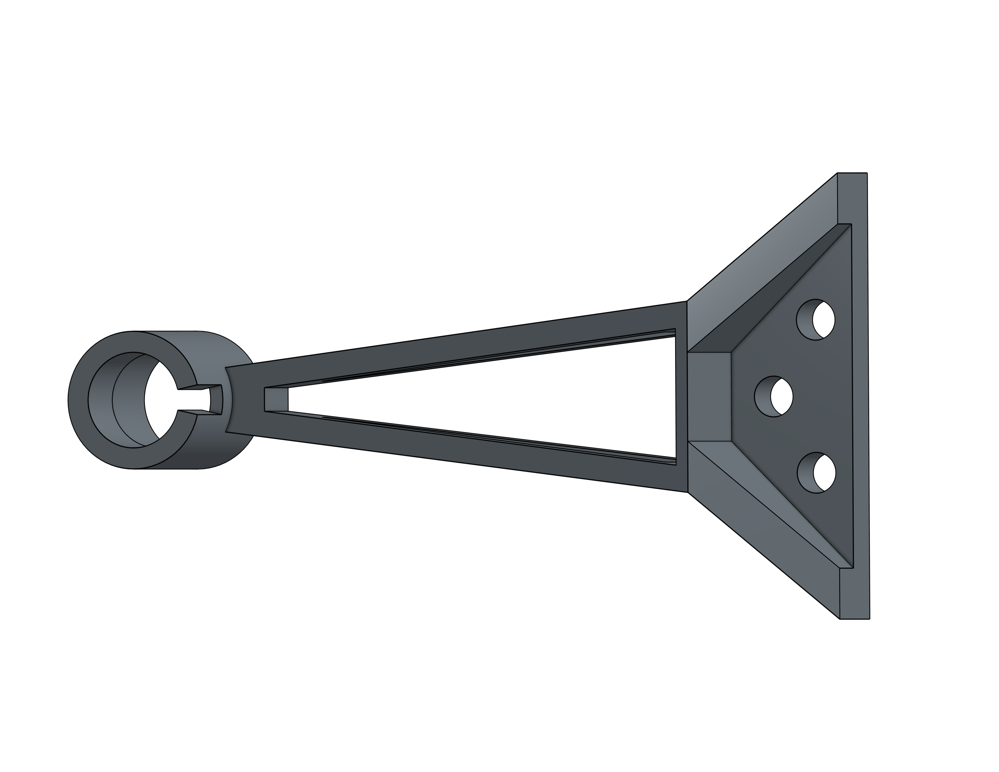
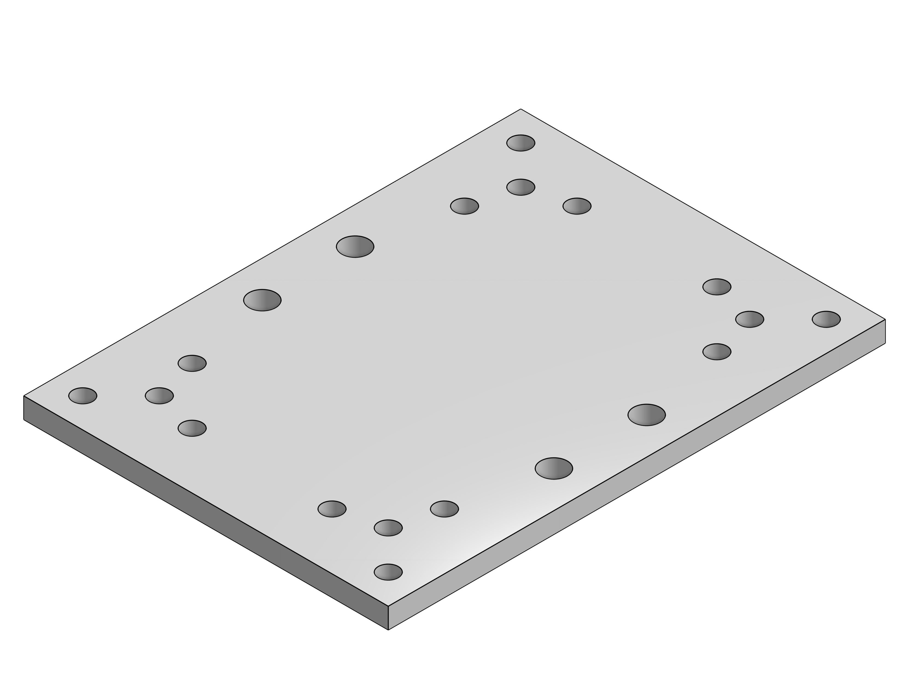
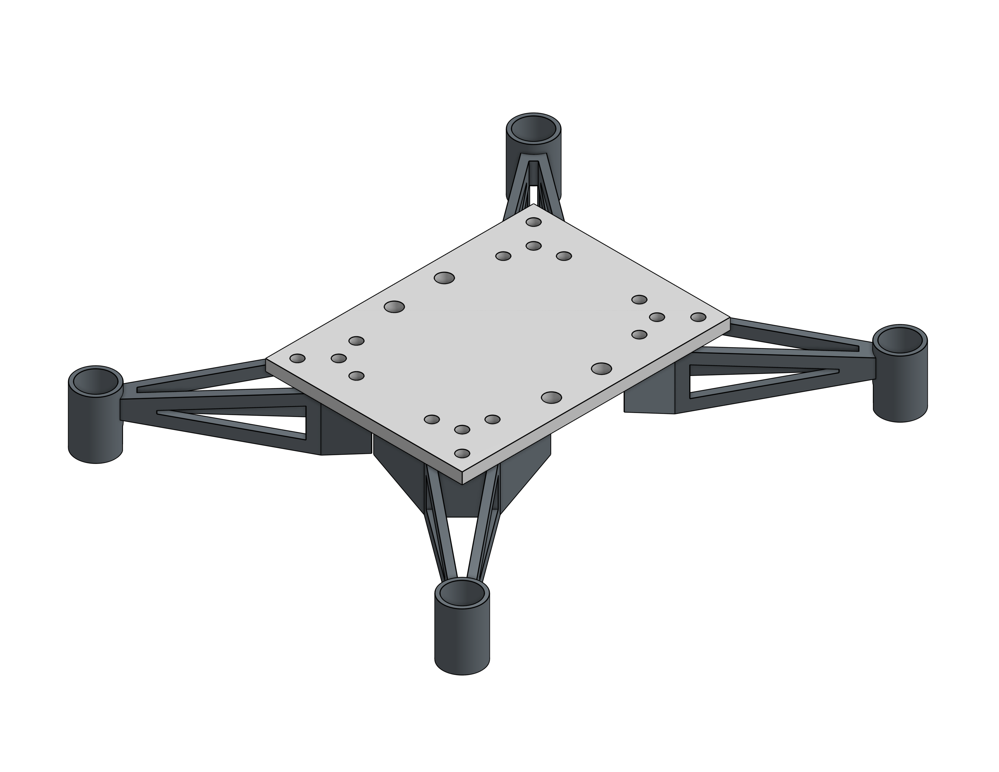
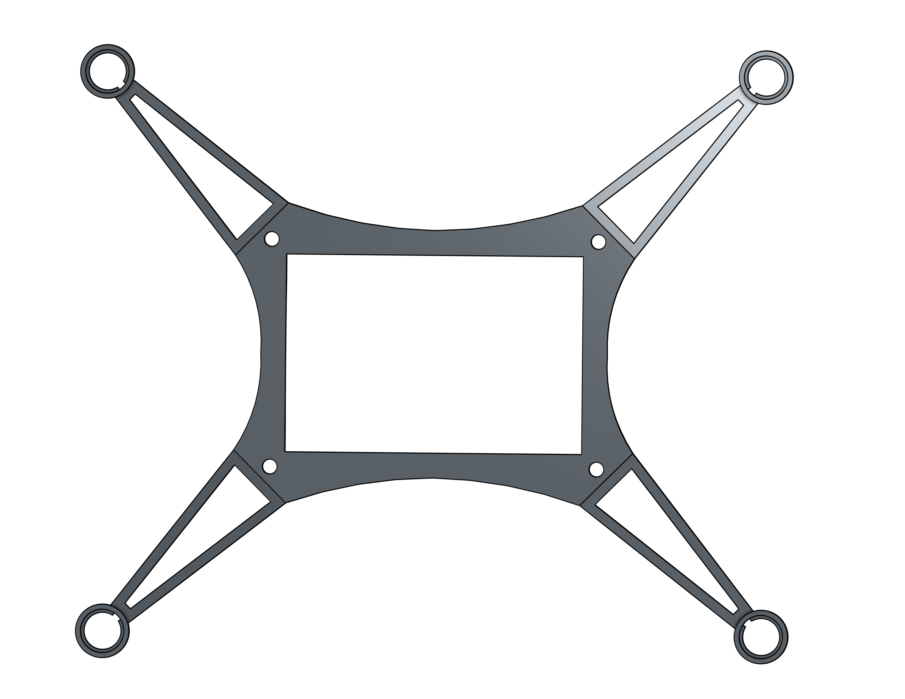
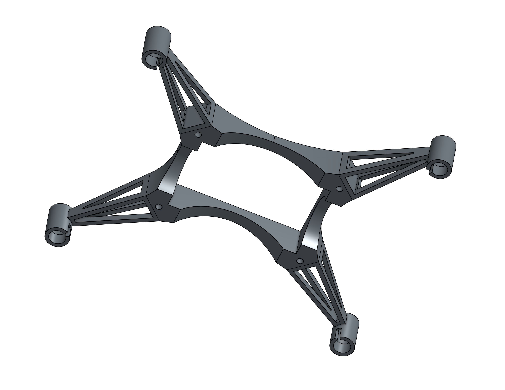

# Drone

## by Sam Funk and Paul Schakel

 

#### [Drone 1.0](https://github.com/sfunk02/drone#drone-10) | [Drone 2.0](https://github.com/sfunk02/drone#drone-20) | [Final Takeaways](https://github.com/sfunk02/drone#final-takeaways)

## Introduction

The goal of this project was to create a drone using a Raspberry Pi Pico. The assignment criteria are as follows:
* Survivability: the payload (RPi Pico, sensors, etc) must survive and function post-flight.
* Custom circuit board: breadboards are for prototyping, not for finished products.  Solder headers onto your board so everything is compact but you can add/remove the Pico and other sensors.
* Data collection: your payload must collect data throughout the flight and save that data to the Pico’s onboard storage. Examples: spin rate (MPU6050), altitude (MPL3115A2), location (GPS).
* Data presentation: Show off that data you collected! Plot the data in some way that is meaningful to your project. 

We decided that a drone would be a reasonably challenging way to accomplish this task.

### Project [Planning](docs/Planning.md)

The initial design...

### Tools Used

* CAD - [Onshape](https://www.onshape.com/en/)
* Code - [VS Code](https://code.visualstudio.com/)
* Wiring Diagram - [Fritzing](https://fritzing.org/)

### Code Prototypes

To make sure we didn't get ahead of ourselves, we created prototypes of the separate parts of the project so that we could test the components before assembling the whole drone:

* [MPU6050 (Accelerometer)](/code/prototypes/accelerometer.py)
* [DRV8833 (Old H-bridge)](/code/prototypes/drv8833.py)
* [TB6612FNG (New H-bridge)](/code/prototypes/tb6612fng.py)

[//]: # (Will add descriptions and go more into detail about the troubles we had with h-bridges)

 
 

## Drone 1.0

### Bill of Materials

* 
* 
* 

### CAD [(Onshape)](https://cvilleschools.onshape.com/documents/ce9d8d739d2d9f15e9173bc0/w/6c76af61bf90a62108bdc466/e/912e9d444323990bdd98e468?renderMode=0&uiState=63b58eecc68e6a59295096d6)

#### Arm

The arm is designed to be lightweight and stable. It accomplishes this with a tapered, hollowed out design. It has a cylinder on the end to fit the motor which acts secondarily as a foot with a small cut-out for wiring to fit through.

#### Base

The base is sized to fit our circuit board of components, which includes a Raspberry Pi Pico, two motor h-bridges, an accelerometer/gyro, and a PowerBoost. The CAD assembly allowed me to measure between the arms and make sure there was space to fit the LiPo battery underneath. The four holes in the middle of the base allow the battery to be tied to the drone.

### Code

### Images

### Issues

 
 

## Drone 2.0

### Bill of Materials

* 
* 
* 

### CAD [(Onshape)](https://cvilleschools.onshape.com/documents/ce9d8d739d2d9f15e9173bc0/w/6c76af61bf90a62108bdc466/e/912e9d444323990bdd98e468?renderMode=0&uiState=63b58eecc68e6a59295096d6)

#### Frame

The new frame design...

### Code

### Images

### Issues

 
 

## Final Takeaways
