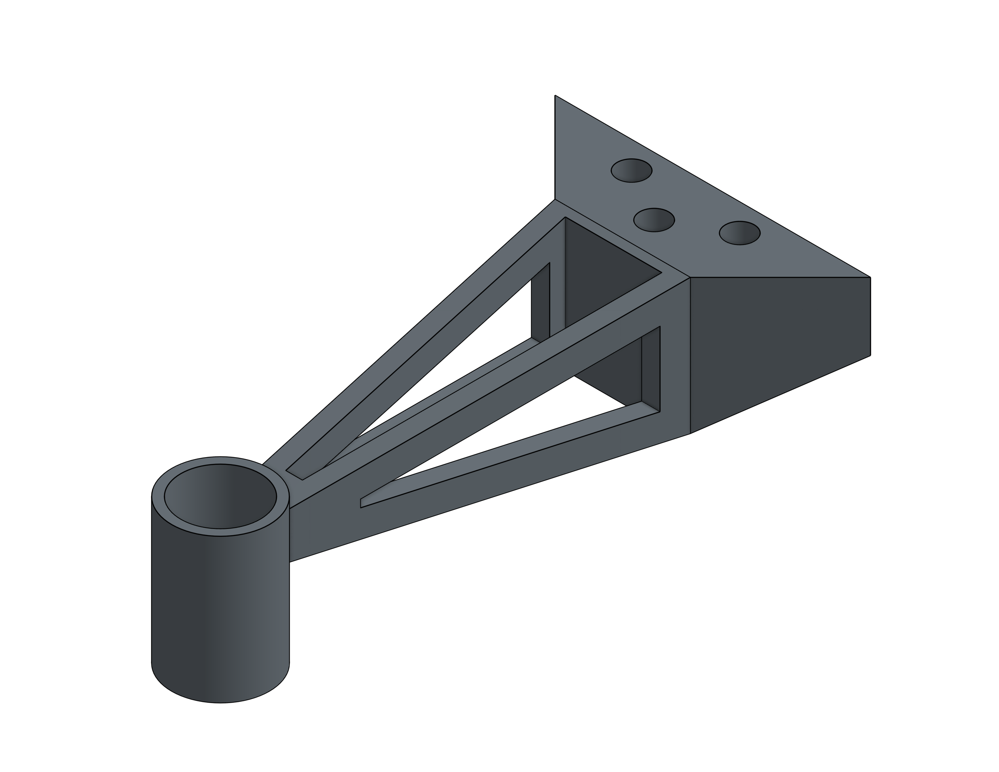
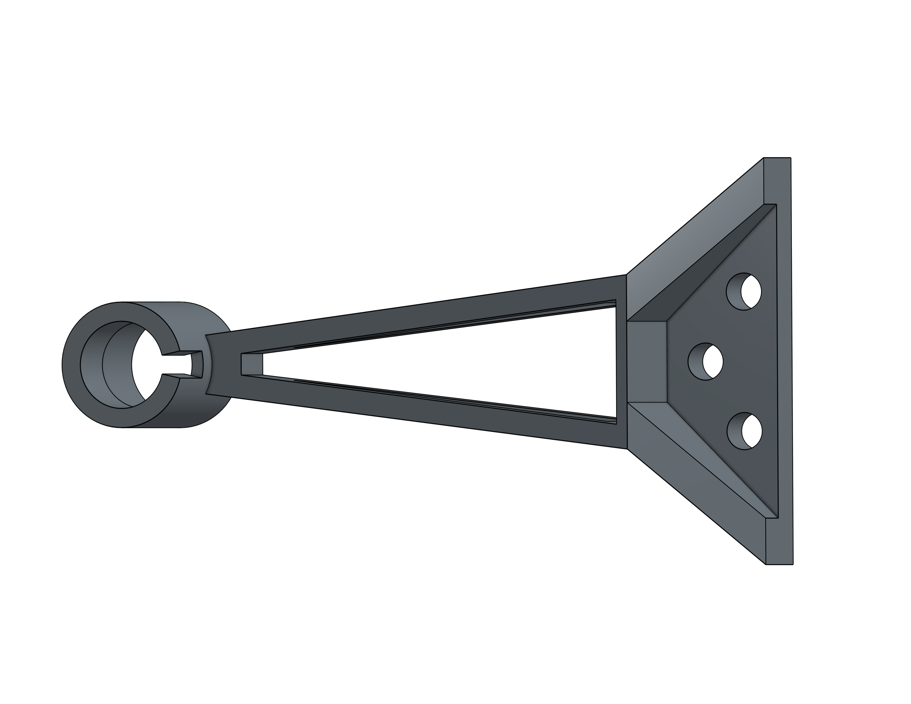
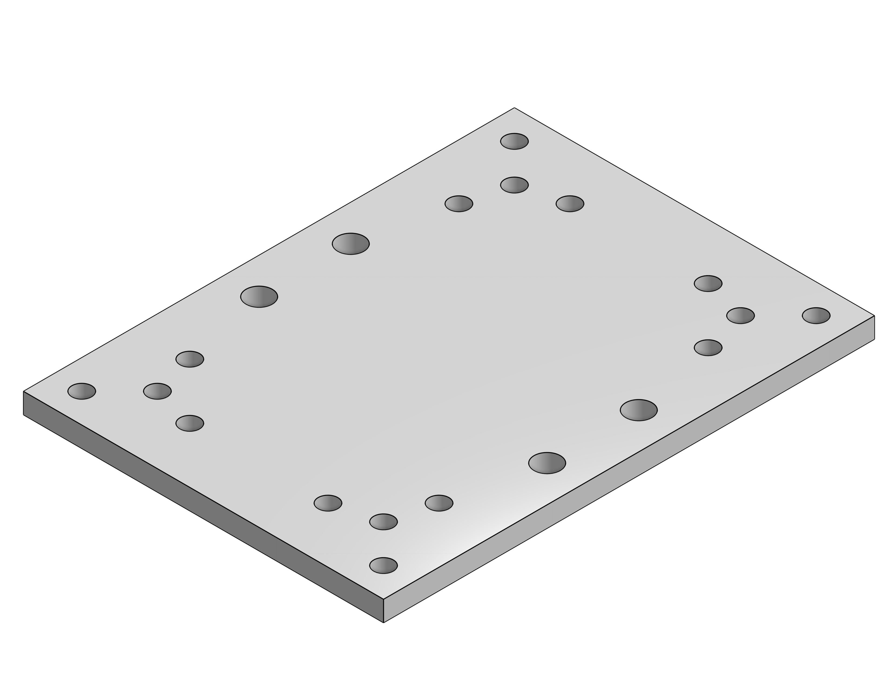
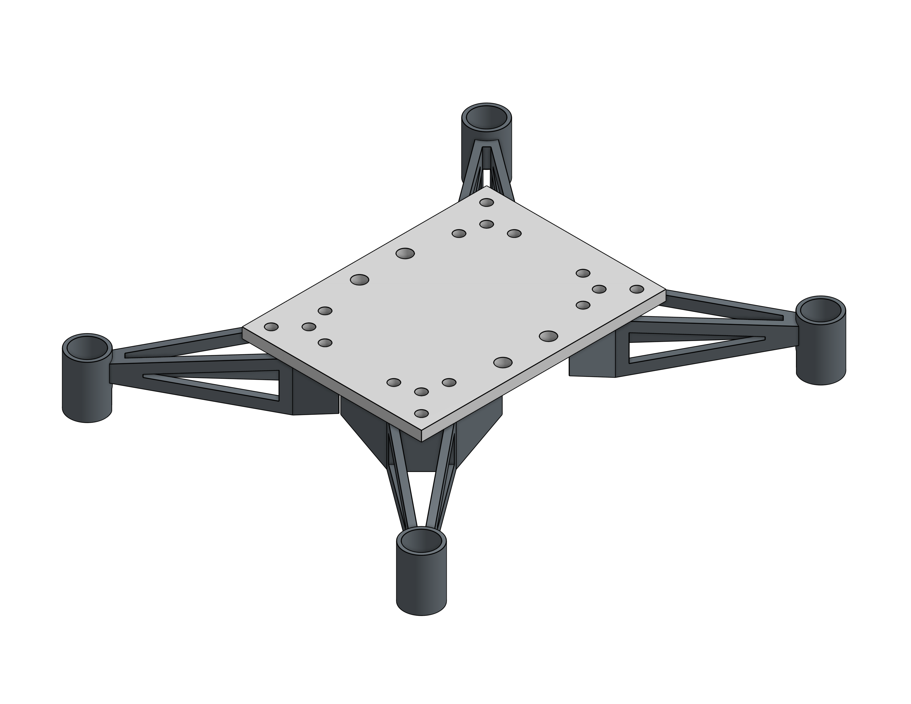

# drone

## Introduction

The goal of this project is to create a drone using a Raspberry Pi Pico. The assignment criteria are as follows:
* Survivability: the payload (RPi Pico, sensors, etc) must survive and function post-flight.
* Custom circuit board: breadboards are for prototyping, not for finished products.  Solder headers onto your board so everything is compact but you can add/remove the Pico and other sensors.
* Data collection: your payload must collect data throughout the flight and save that data to the Pico’s onboard storage. Examples: spin rate (MPU6050), altitude (MPL3115A2), location (GPS).
* Data presentation: Show off that data you collected! Plot the data in some way that is meaningful to your project. 

My partner and I decided that a drone would be a reasonably challenging way to accomplish this task.

## Planning_Stage

[Planning Document](Planning.md)

### CAD

The following CAD sketches were made in [Onshape](https://cvilleschools.onshape.com/documents/ce9d8d739d2d9f15e9173bc0/w/6c76af61bf90a62108bdc466/e/912e9d444323990bdd98e468?renderMode=0&uiState=63b58eecc68e6a59295096d6). 

