# Drone

## by Sam Funk and Paul Schakel

#### [Drone 1.0](https://github.com/sfunk02/drone#drone-10) | [Drone 2.0](https://github.com/sfunk02/drone#drone-20) | [Drone 3.0](https://github.com/sfunk02/drone#drone-30) | [Drone 4.0](https://github.com/sfunk02/drone#drone-40) | [Final Takeaways](https://github.com/sfunk02/drone#final-takeaways)

## Introduction

The goal of this project was to create a drone using a Raspberry Pi Pico. The assignment criteria are as follows:
* Survivability: the payload (RPi Pico, sensors, etc) must survive and function post-flight.
* Custom circuit board: breadboards are for prototyping, not for finished products.  Solder headers onto your board so everything is compact but you can add/remove the Pico and other sensors.
* Data collection: your payload must collect data throughout the flight and save that data to the Pico’s onboard storage. Examples: spin rate (MPU6050), altitude (MPL3115A2), location (GPS).
* Data presentation: Show off that data you collected! Plot the data in some way that is meaningful to your project. 

We decided that a drone would be a reasonably challenging way to accomplish this task.

### Project [Planning](docs/Planning.md)

The initial design was derived from a DJI Tello drone. We wanted the drone to be as compact and small as possible to reduce weight so it could be lifted by our Tello motors. We intend to add cages for the propellers to add a level of safety to the drone, but they were not included in our first prototype. The nature of the project is to make something fly with a Raspberry Pi Pico, so that is the microcontroller we chose to use. We decided to power our prototype with a 2000mAh LiPo battery and two DRV8833 H-bridges because we have a surplus of both in our engineering lab.

### Tools Used

* CAD - [Onshape](https://www.onshape.com/en/)
* Code - [VS Code](https://code.visualstudio.com/)
* Wiring Diagram - [Fritzing](https://fritzing.org/)

### Code Prototypes

To make sure we didn't get ahead of ourselves, we created prototypes of the separate parts of the project so that we could test the components before assembling the whole drone:

* [MPU6050 (accelerometer)](/code/prototypes/accelerometer.py)
* [DRV8833 (old H-bridge)](/code/prototypes/drv8833.py)
* [TB6612FNG (new H-bridge)](/code/prototypes/tb6612fng.py)

 
 

## Drone 1.0

### Bill of Materials

* Raspberry Pi Pico
* 2000mAh LiPo battery
* x2 DRV8833 (old H-bridge)
* MPU6050 (accelerometer)
* PowerBoost
* acrylic
* ABS (3D print material)
* x4 Tello motors
* x4 Tello propellers
* x4 1.25mm female JST connectors
* circuit board
* wires and solder
* hardware to attach arms and base

### CAD [(Onshape)](https://cvilleschools.onshape.com/documents/ce9d8d739d2d9f15e9173bc0/w/6c76af61bf90a62108bdc466/e/912e9d444323990bdd98e468?renderMode=0&uiState=63b58eecc68e6a59295096d6)

#### Arm

The arm is designed to be lightweight and stable. It accomplishes this with a tapered, hollowed out design. It has a cylinder on the end to fit the motor which acts secondarily as a foot with a small cut-out for wiring to fit through.

#### Base

The base is sized to fit our circuit board of components, which includes a Raspberry Pi Pico, two motor h-bridges, an accelerometer/gyro, and a PowerBoost. The CAD assembly allowed me to measure between the arms and make sure there was space to fit the LiPo battery underneath. The four holes in the middle of the base allow the battery to be tied to the drone.

### Code

[Link to Code](code/final_code_1.0.py)

### Wiring

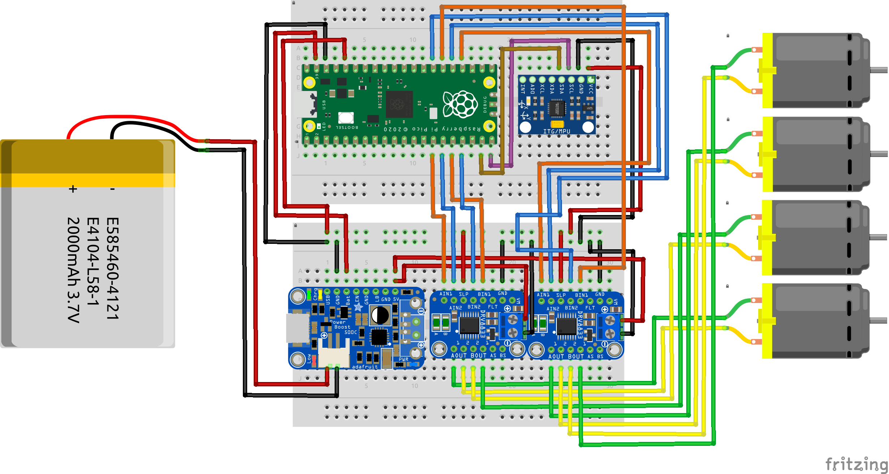

### Images

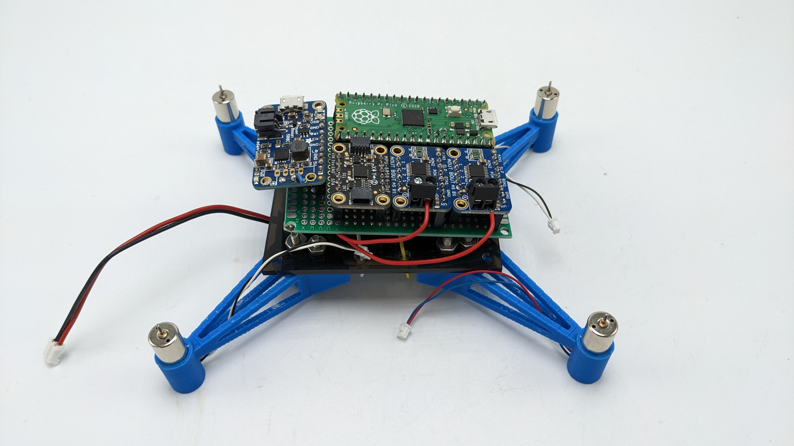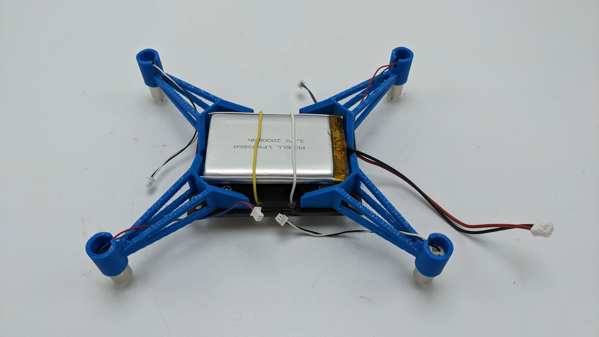

### Issues

Between the sheet of acrylic, large battery, and unnecessary amount of hardware, our first design was too heavy. We used Tello motors, but our drone weighed almost twice as much as a Tello. We also noticed that our motors were not spinning fast enough when powered through our drone. After a lot of troubleshooting and testing, we determined that this was due to a combination of our battery, PowerBoost, and H-bridges. Both the PowerBoost and the H-bridges were limiting current, and the battery itself couldn't output current fast enough with everything else bypassed.

 
 

## Drone 2.0

### Bill of Materials

* Raspberry Pi Pico
* 1100mAh Tello battery
* x2 TB6612FNG (new H-bridge)
* MPU6050 (accelerometer)
* ABS (3D print material)
* x4 Tello motors
* x4 Tello propellers
* x4 1.25mm female JST connectors
* circuit board
* wires and solder
* hardware to attach frame to circuit board

Changes:

We switched out our H-bridges and battery, eliminated the PowerBoost, and wired the power source directly to the board to bypass any current limiting. No acrylic was needed because the new design fit the circuit board directly to the ABS frame. We used less hardware because the arms didn't need to be attached separately (see images below).

### CAD [(Onshape)](https://cvilleschools.onshape.com/documents/ce9d8d739d2d9f15e9173bc0/w/6c76af61bf90a62108bdc466/e/912e9d444323990bdd98e468?renderMode=0&uiState=63b58eecc68e6a59295096d6)

#### Frame

The new frame design...

### Code

[Link to Code](code/final_code_2.0.py)

### Wiring

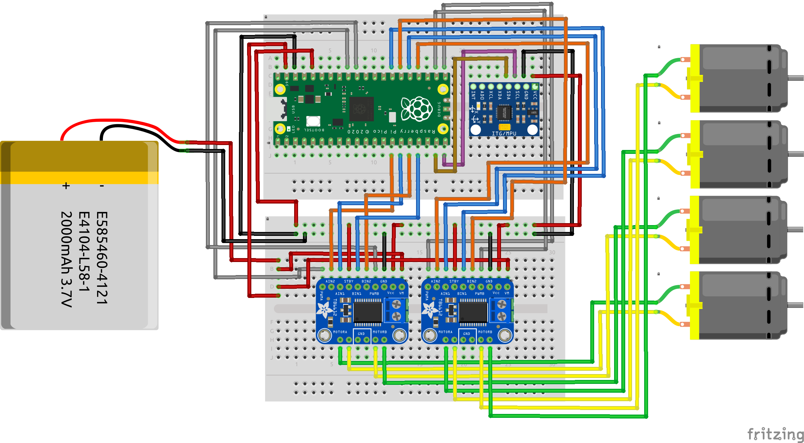

### Images

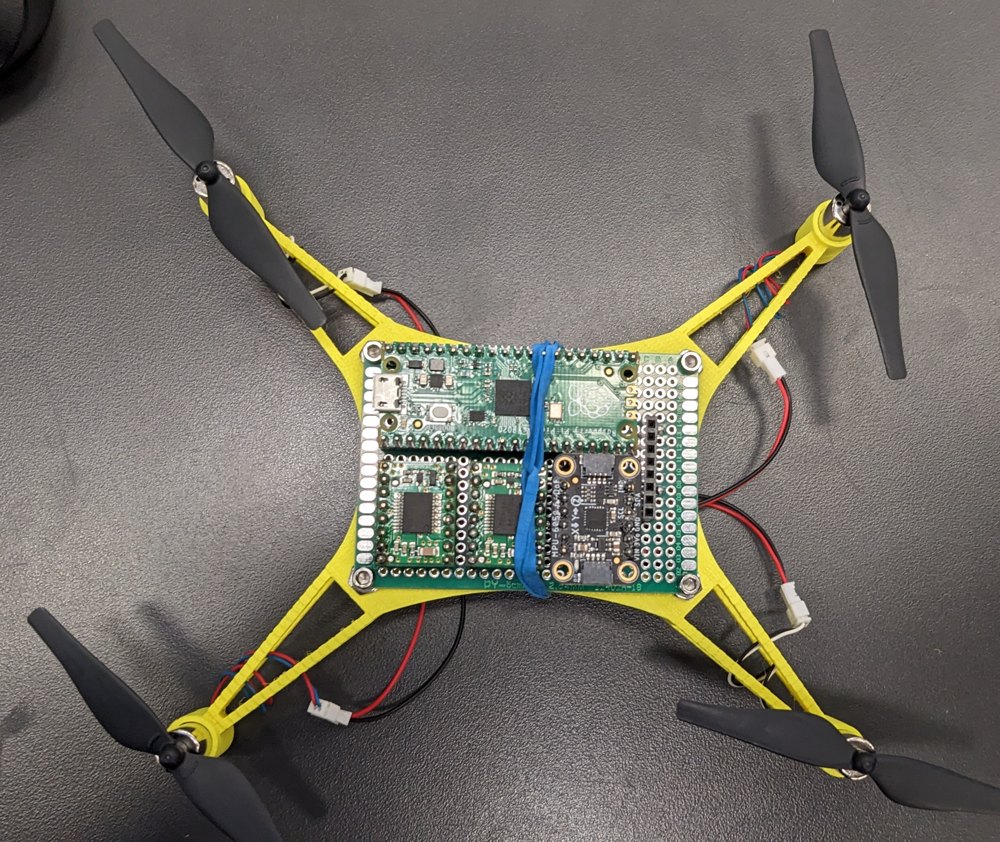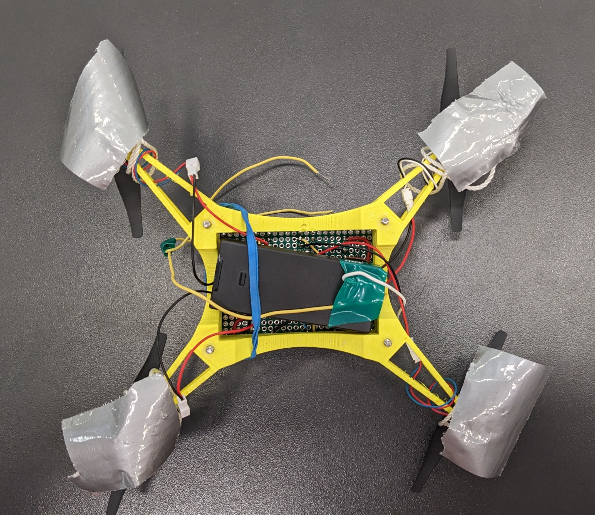

### Issues

Standby pin disconnected on one h-bridge, PWM signal and 3.3V sent to wrong pins requiring some re-soldering

 
 

## Drone 3.0

### Bill of Materials

* Raspberry Pi Pico
* 1100mAh Tello battery
* x4 IRLB8721 MOSFETs
* LSM6DSO (accelerometer)
* ABS (3D print material)
* x4 Tello motors
* x4 Tello propellers
* x4 1.25mm female JST connectors
* circuit board
* wires and solder
* hardware to attach frame to circuit board

Changes:

We originally switched out our 2 H-bridges with 4 transistors (1 per motor) and tested it on a breadboard. We found that the amount of current pulled by our motors was too great, and caused the transistors to smoke. To allow a greater flow of current without limiting our voltage, we switched out the transistors with N-Channel MOSFETs that are rated to a much higher current and voltage. They also have heatsinks, and shouldn't overheat like our previous H-bridges. We also switched out our MPU6050 accelerometer for a more accurate LSM6DSO.

### Code

[Link to Code](code/final_code_3.0.py)

### Wiring

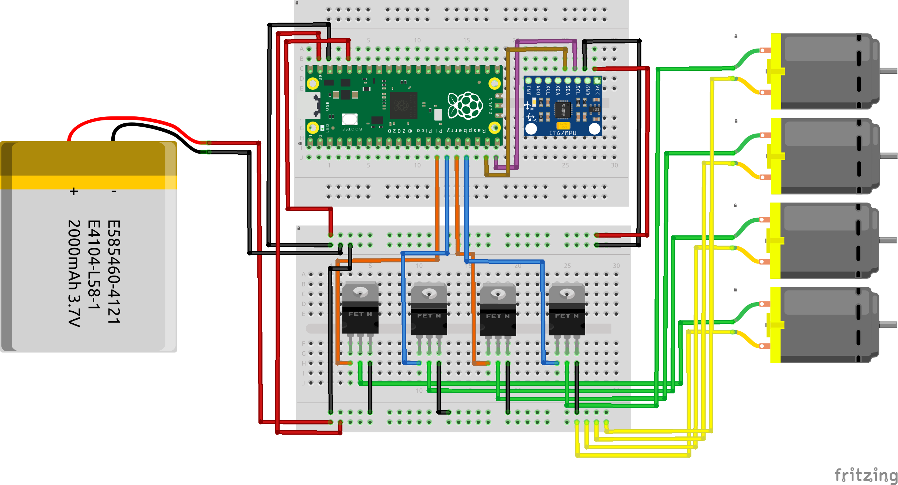

### Images

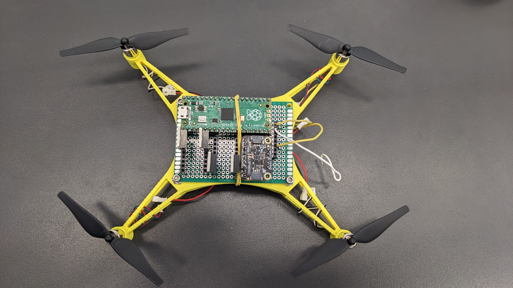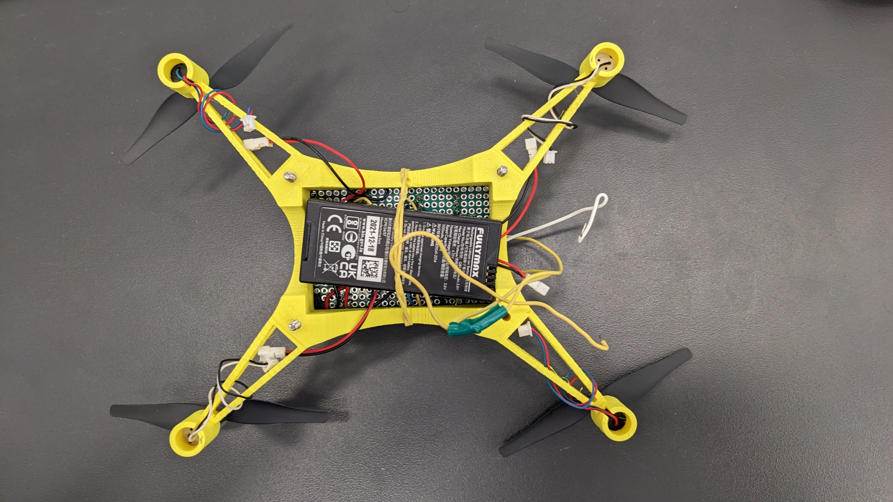

### Issues

The Pico keeps wiping at seemingly random times, leading us to believe that there is a short somewhere in the circuitry caused by continual movement of the drone. We aren't able to trace the short and decided it would be better to solder a new circuit board. Additionally, the rectangular shape of the drone causes issues with the code for the accelerometer, and the battery is only attached with a rubber band. Drone 4.0 will address all of these problems.

 
 

## Drone 4.0

### Bill of Materials

* Raspberry Pi Pico
* 1100mAh Tello battery
* x4 IRLB8721 MOSFETs
* LSM6DSO (accelerometer)
* ABS (3D print material)
* x4 Tello motors
* x4 Tello propellers
* x4 1.25mm female JST connectors
* circuit board
* wires and solder
* hardware to attach frame to circuit board

Changes:

We soldered a new circuit board and redesigned/printed a new frame for the drone. The new circuit board has cleaner soldering to reduce the risk of shorts and includes a power switch for easier usage. The new frame is square in shape to make the accelerometer readings more accurate in relation to the motor positions and also has a built in mount for the battery.

### CAD [(Onshape)](https://cvilleschools.onshape.com/documents/ce9d8d739d2d9f15e9173bc0/w/6c76af61bf90a62108bdc466/e/912e9d444323990bdd98e468?renderMode=0&uiState=63b58eecc68e6a59295096d6)

#### Frame (updated)
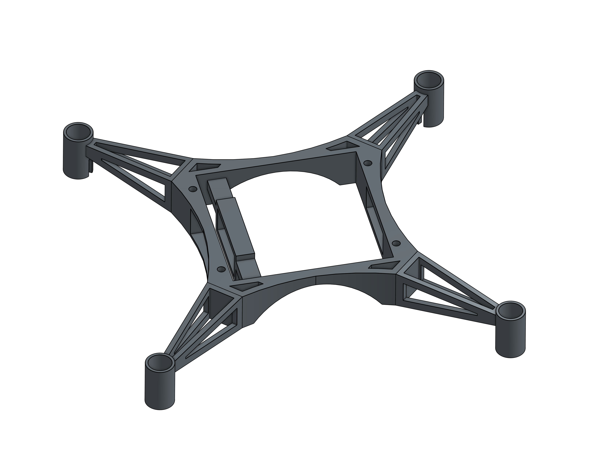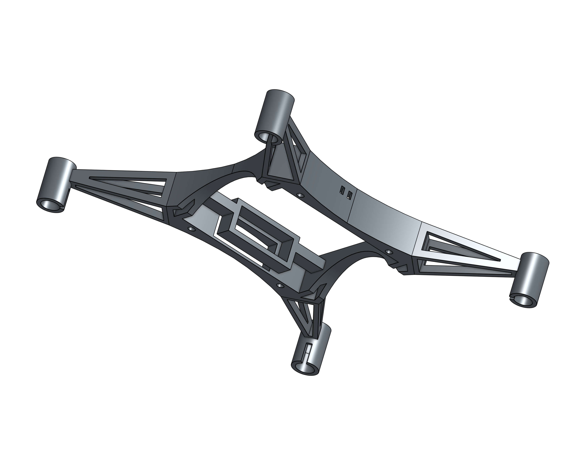

The square frame design is intended to result in better stability and a more accurate PID function. The updated design also includes a mount for the battery.

### Code

[Link to Code](code/final_code_4.0.py)

### Wiring

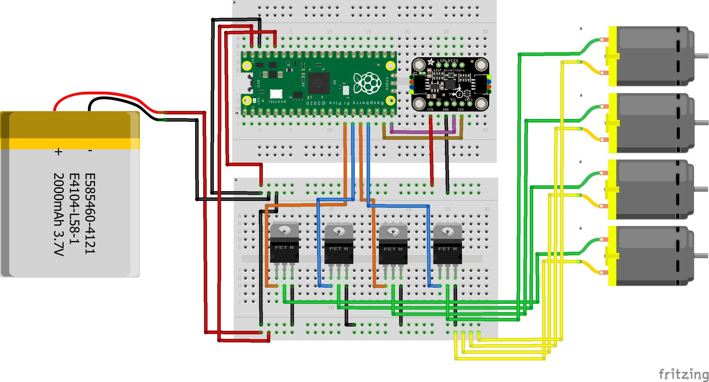

### Images

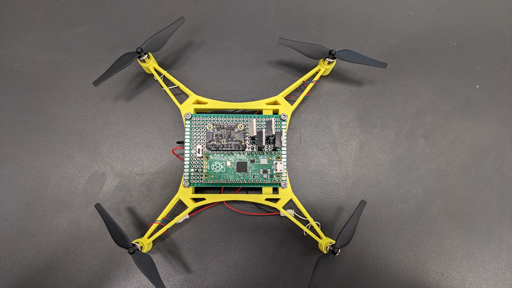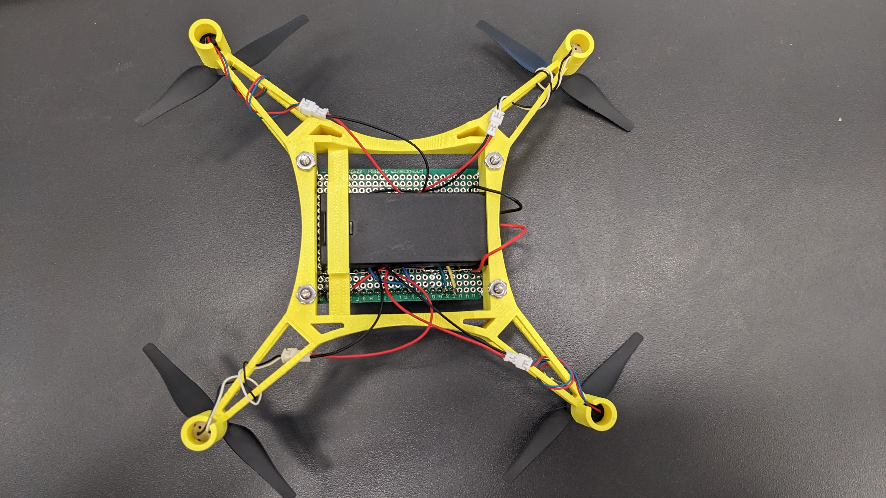

### Issues

The power switch melted because we sent more current through it than it could handle. We replaced it with a much heavier duty panel-mount style switch. Then, the wires going to the battery started melting so we replaced them with much heavier gauge wire. To add data logging functionality, we had to add another small switch to the circuit board to switch the Pi between read-only mode and write-only mode.

 
 

## Final Takeaways

### Test Bench:

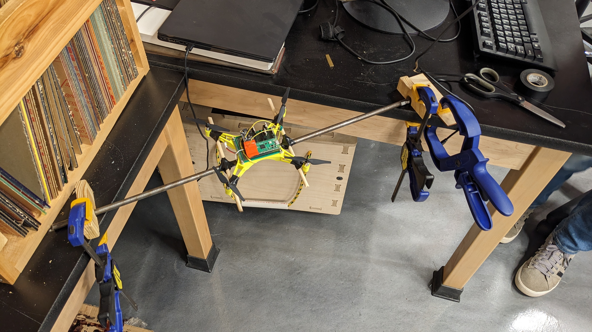

The test bench was the system we developed to code and tune our PID for the drone. Our original setup was a board with the drone attached by strings. This didn't work very well, as the drone would swing back and forth on the strings and was never able to balance itself in the middle. We instead opted to have a rod to which the drone was attached, which moved the fulcrum point directly to the bottom of the drone. We still had trouble with getting it to balance, but our PID did seem to get a bit better than it had previously been.

### Final Launch:

Unfortunately, our drone did not work very well. We think that the PID caused the drone to launch sideways instead of up, which is why it went straight into the ground. If we had more time to tune the PID, we probably could've gotten it to hover and balance itself. We also maybe could've had a more successful launch if we disabled PID altogether, but that would've been sad because we spent multiple weeks on it.

### Graph of Data:

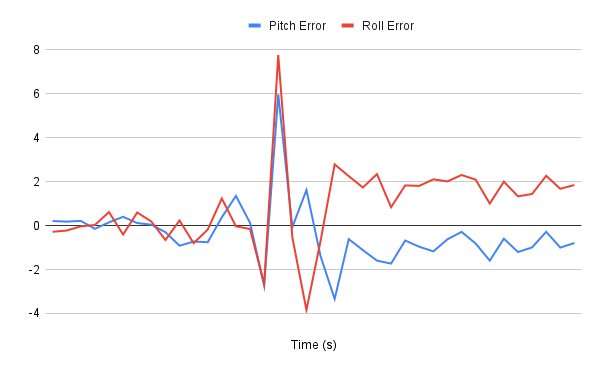

As you can see in the graph, there is a large spike in both pitch and roll error in the middle, followed by a drop and an approximate flatline. The spike is when the drone lurches sideways off the cone, causing a lot of force to act on the accelerometer. The drop is when the drone hits the ground, and then the flatline follows when it stays in the same place for a few seconds.

### Final Reflection:

We learned a lot about code, PID, and 3D design throughout the duration of this project. Unfortunately, we never got it working 100%, but we did get very close. Designing a drone was a very fun challenge and I'm glad we attempted it. If we had more time, we potentially would have been able to properly tune the PID and get the drone to balance itself. We also wanted to add an additional board to the drone that would allow it to connect to a controller and be maneuvered wirelessly during flight. Even though we didn't get it working, I am now confident in my ability to design and create a new drone in only 2-3 class periods.
